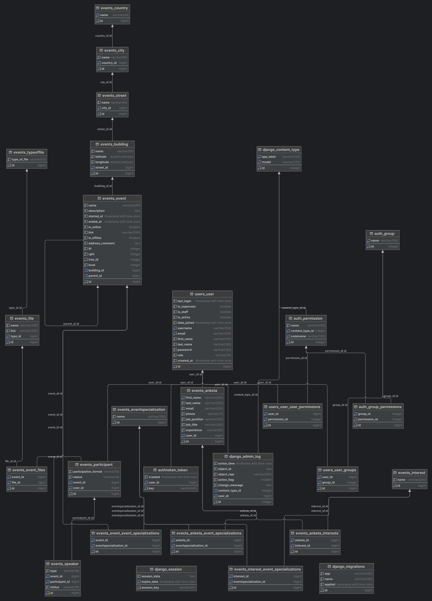

# API Яндекс.Сфера
## Описание:

[Схема базы данных](https://dbdiagram.io/d/660941d537b7e33fd7237b92)   

### Модель данных:


### Схема БД:




**IP тестового сервера**: 158.160.162.168

## Технологии:

[](https://skillicons.dev)

## Пользователи

### 1. Суперпользоаватель (вход в админку):

      email: admin@h.com 

      password: 111111

### 2. Василий Пупкин:

      email: vasya@h.com

      password: zxc102938

### 3. Джо Блэк:

      email: joe@h.com

      password: mko091122

## Возможности проета:

События представляют собой дерево. Использована библиотека django-mptt.     
Вершина дерева - это главное событие (конференция)      
Из дочерних событий складывается программа конференции.      
Таким образом, мы не ограничены в продолжительности события. Мы можем создавать события и те которые идут 3 дня и те , которые идут 2 часа. Так же есть возможность запускать параллельные сессии в рамках одной конференции.      

Можно реализовать в будущем:      
При существующей схеме БД можно создавать циклические события, без дат, на которые пользователь может подписаться. И когда появляется оределенность со временем и с местом, то добавить его как дочернеее и всем подписанным на него пользователям придет уведомление, в выбранном формате.      

Сейчас реализовано API со стороны пользователя.      
Есть стандартная админка от Django. В дальнейшем можно реализовать кабинет для организаторов или создать API для подключения к платформе.   


## Что сделано:      

Подключена пагинация при возвращении списка:
* событий,

Версионирование API

Тестовая БД с данными

1. **Специализации (теги для событий)**

* `api/v1/event-specialization/` (**GET**): получить список всех специализаций

**Пример запроса**

```
GET api/v1/event-specialization/
Права доступа: Доступно без токена
Response:
[
    {
        "id": 1,
        "name": "Phyton",
    }
]
``` 

* `api/v1/event-specialization/{id}/` (**GET**): получить специализацию по id.

**Пример запроса**
``` 
GET api/v1/event-specialization/{id}/
Права доступа: Доступно без токена.
Response:
{
    "id": 1,
    "name": "Phyton",
}
``` 

2. **Направления деятельности(для анкеты)**

* `api/v1/interest/` (**GET**): получить список всех направлений деятельности

**Пример запроса**

```
GET api/v1/interest/
Права доступа: Доступно без токена
Response:
[
    {
        "id": 1,
        "name": "Backend",
    }
]
``` 

* `api/v1/interest/{id}/` (**GET**): получить направление деятельности по id.

**Пример запроса**
``` 
GET api/v1/interest/{id}/
Права доступа: Доступно без токена.
Response:
{
    "id": 1,
    "name": "Backend",
}
``` 

3. **Анкета пользователя (для регистрации на событие)**

* `api/v1/anketa/` (**POST**): создать анкету

**Пример запроса**

```
POST api/v1/anketa/
Права доступа: Авторизованный пользователь
Request:
{
    "id": 1,
    "first_name": "Василий",
    "last_name": "Васильев",
    "email": "vasya@yandex.ru",
    "phone": "89234565123",
    "job_position": "Google+",
    "job_title": "Backend Разработчик",
    "experience": "От 3 лет",
    "event_specializations": [
        3,
        4,
        9,
        10,
        11
    ],
    "interests": [
        1
    ]
}

Response:
[
   {
       "id": 1,
       "user": 1,
       "first_name": "Василий",
       "last_name": "Васильев",
       "email": "vasya@yandex.ru",
       "phone": "89234565123",
       "job_position": "Google+",
       "job_title": "Backend Разработчик",
       "experience": "От 3 лет",
       "event_specializations": [
           {
               "id": 3,
               "name": "Разработка"
           },
           {
               "id": 4,
               "name": "Python"
           },
           {
               "id": 9,
               "name": "Java"
           },
           {
               "id": 10,
               "name": "C++"
           },
           {
               "id": 11,
               "name": "Другое"
           }
       ],
       "interests": [
           {
               "id": 1,
               "name": "Backend"
           }
       ]
   }
]
``` 

* `api/v1/anketa/{id}/` (**GET, PATCH**): получить анкету по id и отредактировать.

**Пример запроса**
``` 
GET api/v1/anketa/{id}/
Права доступа: Доступно только пользователю, который ее создал.
Response:
{
    "id": 1,
    "user": 1,
    "first_name": "Василий",
    "last_name": "Васильев",
    "email": "vasya@yandex.ru",
    "phone": "89234565123",
    "job_position": "Google+",
    "job_title": "Backend Разработчик",
    "experience": "От 3 лет",
    "event_specializations": [
        {
            "id": 3,
            "name": "Разработка"
        },
        {
            "id": 4,
            "name": "Python"
        },
        {
            "id": 9,
            "name": "Java"
        },
        {
            "id": 10,
            "name": "C++"
        },
        {
            "id": 11,
            "name": "Другое"
        }
    ],
    "interests": [
        {
            "id": 1,
            "name": "Backend"
        }
    ]
}


PATCH api/v1/anketa/{id}/
Права доступа: Доступно только пользователю, который ее создал.
Request:
{
    "id": 1,
    "first_name": "Василий",
    "last_name": "Васильев",
    "email": "vasya@yandex.ru",
    "phone": "89234565123",
    "job_position": "Google+",
    "job_title": "Backend Разработчик",
    "experience": "От 3 лет",
    "event_specializations": [
        3,
        4,
        9,
        10,
        11
    ],
    "interests": [
        1
    ]
}

Response:
[
   {
       "id": 1,
       "user": 1,
       "first_name": "Василий",
       "last_name": "Васильев",
       "email": "vasya@yandex.ru",
       "phone": "89234565123",
       "job_position": "Google+",
       "job_title": "Backend Разработчик",
       "experience": "От 3 лет",
       "event_specializations": [
           {
               "id": 3,
               "name": "Разработка"
           },
           {
               "id": 4,
               "name": "Python"
           },
           {
               "id": 9,
               "name": "Java"
           },
           {
               "id": 10,
               "name": "C++"
           },
           {
               "id": 11,
               "name": "Другое"
           }
       ],
       "interests": [
           {
               "id": 1,
               "name": "Backend"
           }
       ]
   }
]
``` 

4. **Событие**

* `api/v1/events/` (**GET**): получить список всех событий

**Пример запроса**

```
GET api/v1/events/
Права доступа: Доступно без токена
Response:

[
    {
        "id": 1,
        "name": "Встреча РГ21 С++",
        "description": "Приглашаем практикующих разработчиков С++ и энтузиастов языка на встречу Российской рабочей группы 
            по стандартизации С++ (РГ21 C++). На мероприятии обсудим новости последних встреч Международного комитета по 
            стандартизации C++, самые интересные новинки C++26, когда ждать рефлексию и std:get для пользовательских структур. 
            Руководитель РГ21 С++ Антон Полухин ответит на вопросы о возможностях для российских разработчиков участвовать в 
            развитии стандарта языка. А ещё мы вместе погенерим идеи для новых изменений! Встреча пройдёт в офисе Яндекса в 
            Санкт-Петербурге. Так же будет онлайн трансляция. Всем зарегистрированным отправим ссылку на трансляцию.",
        "started_at": "13.05.2024 18:00:00",
        "ended_at": "13.05.2024 21:00:00",
        "is_online": true,
        "link": null,
        "is_offline": true,
        "address_comment": "",
        "city": "Москва",
        "event_specializations": [
            {
                "id": 1,
                "name": "Анализ данных"
            },
            {
                "id": 2,
                "name": "Маркетинг"
            },
            {
                "id": 3,
                "name": "Разработка"
            }
        ]
    }
]

``` 

* `api/v1/events/{id}/` (**GET**): получить событие по id.

**Пример запроса**
``` 
GET api/v1/events/{id}/
Права доступа: Доступно без токена.
Response:
{
    "id": 1,
    "name": "Встреча РГ21 С++",
    "description": "Приглашаем практикующих разработчиков С++ и энтузиастов языка на встречу Российской рабочей группы 
         по стандартизации С++ (РГ21 C++). На мероприятии обсудим новости последних встреч Международного комитета по 
         стандартизации C++, самые интересные новинки C++26, когда ждать рефлексию и std:get для пользовательских структур. 
         Руководитель РГ21 С++ Антон Полухин ответит на вопросы о возможностях для российских разработчиков участвовать в 
         развитии стандарта языка. А ещё мы вместе погенерим идеи для новых изменений! Встреча пройдёт в офисе Яндекса в 
         Санкт-Петербурге. Так же будет онлайн трансляция. Всем зарегистрированным отправим ссылку на трансляцию.",
    "started_at": "13.05.2024 18:00:00",
    "ended_at": "13.05.2024 21:00:00",
    "is_online": true,
    "link": null,
    "is_offline": true,
    "address_comment": "",
    "address": {
        "country": {
            "id": 1,
            "name": "Russia"
        },
        "city": {
            "id": 1,
            "name": "Москва"
        },
        "street": {
            "id": 1,
            "name": "Арбат"
        },
        "building": {
            "id": 1,
            "name": "32",
            "latitude": 55.749096,
            "longitude": 37.589599
        }
    },
    "event_specializations": [
        {
            "id": 1,
            "name": "Анализ данных"
        },
        {
            "id": 2,
            "name": "Маркетинг"
        },
        {
            "id": 3,
            "name": "Разработка"
        }
    ],
    "speaker":[]
    "files":[
      {
            "id": 1,
            "name": "Анализ данных",
            "link": "https://www.youtube.com/watch?v=F",
            "type": "face of event"
        },
    ] 
    "children": [
        {
            "id": 2,
            "name": "Регистрация в офлайн",
            "description": "Регистрация",
            "started_at": "13.05.2024 18:00:00",
            "ended_at": "13.05.2024 19:00:00",
            "is_online": false,
            "link": null,
            "is_offline": true,
            "address_comment": "",
            "address": null,
            "event_specializations": [
                {
                    "id": 11,
                    "name": "Другое"
                }
            ],
            "speaker":[
               {
                  "id": 2,
                  "type": "speaker"
                  "personal_data":{
                     "first_name": "Василий",
                     "last_name": "Васильев"
                     "job_position": "Google+",
                     "job_title": "Backend Разработчик",
                  }
               }
            ]
            "files":[]
            "children":[]
        },
        {
            "id": 3,
            "name": "Новости со встречи международного Комитета по стандартизации  языка С++",
            "description": "Расскажем, как устроен сервис, связывающий мир виртуальных сетей с классическими 
               маршрутизаторами и сетевыми устройствами, и как он позволяет создавать гибридную облачную инфраструктуру.",
            "started_at": "13.05.2024 19:00:00",
            "ended_at": "13.05.2024 20:00:00",
            "is_online": true,
            "link": "https://www.youtube.com/watch?v=F",
            "is_offline": true,
            "address_comment": "",
            "address": null,
            "event_specializations": [
                {
                    "id": 10,
                    "name": "C++"
                }
            ],
            "files":[]
            "speaker":[
               {
                  "id": 2,
                  "type": "speaker"
                  "personal_data":{
                     "first_name": "Василий",
                     "last_name": "Васильев"
                     "job_position": "Google+",
                     "job_title": "Backend Разработчик",
                  }
               }
            ]
            "files":[]
            "children": []
        },
        {
            "id": 4,
            "name": "Обсуждение идеи для новых изменений в стандарте",
            "description": "Расскажем про устройство и компоненты, которые используются для построения 
               высоконагруженного и стабильного облачного DNS, а также о планах развития сервиса.",
            "started_at": "13.05.2024 20:00:00",
            "ended_at": "13.05.2024 21:00:00",
            "is_online": true,
            "link": null,
            "is_offline": true,
            "address_comment": "",

            "address": null,
            "event_specializations": [
                {
                    "id": 2,
                    "name": "Маркетинг"
                }
            ],
            "speaker":[
               {
                  "id": 2,
                  "type": "speaker"
                  "personal_data":{
                     "first_name": "Василий",
                     "last_name": "Васильев"
                     "job_position": "Google+",
                     "job_title": "Backend Разработчик",
                  }
               }
            ]
            "files":[]
            "children": []
        }
    ]
}

``` 

5. Регистрация на событие

* `api/v1/events/{id}/participant/` (**POST**): Зарегистрироваться на выбранное событие.

**Пример запроса**
```
POST api/v1/events/{id}/participant/
Права доступа: Авторизованный пользователь.
Формат ["offline", "online"]
Request:
{
    "participation_format": "offline"
}

Response:
{
    "event": {
        "id": 1,
        "name": "Встреча РГ21 С++",
        "description": "Приглашаем практикующих разработчиков С++ ...",
        "started_at": "13.05.2024 18:00:00",
        "ended_at": "13.05.2024 21:00:00",
        "is_online": true,
        "link": null,
        "is_offline": true,
        "address_comment": "",
        "address": {
            "country": {
                "id": 1,
                "name": "Russia"
            },
            "city": {
                "id": 1,
                "name": "Москва"
            },
            "street": {
                "id": 1,
                "name": "Арбат"
            },
            "building": {
                "id": 1,
                "name": "32",
                "latitude": 55.749096,
                "longitude": 37.589599
            }
        },
        "event_specializations": [
            {
                "id": 1,
                "name": "Анализ данных"
            },
            {
                "id": 2,
                "name": "Маркетинг"
            },
            {
                "id": 3,
                "name": "Разработка"
            }
        ],
        "speaker":[]
        "files":[
            {
                 "id": 1,
                 "name": "Анализ данных",
                 "link": "https://www.youtube.com/watch?v=F",
                 "type": "face of event"
            },
        ] 
        "children": [
            {
                "id": 2,
                "name": "Регистрация в офлайн",
                "description": "Регистрация",
                "started_at": "13.05.2024 18:00:00",
                "ended_at": "13.05.2024 19:00:00",
                "is_online": false,
                "link": null,
                "is_offline": true,
                "address_comment": "",
                "address": null,
                "event_specializations": [
                    {
                        "id": 11,
                        "name": "Другое"
                    }
                ],
                "speaker":[
                     {
                        "id": 2,
                        "type": "speaker"
                        "personal_data":{
                           "first_name": "Василий",
                           "last_name": "Васильев"
                           "job_position": "Google+",
                           "job_title": "Backend Разработчик",
                        }
                     }
                ]
                "files":[]
                "children": []
            },
            {
                "id": 3,
                "name": "Новости со встречи международного Комитета по стандартизации  языка С++",
                "description": "Расскажем, как устроен сервис, связывающий мир виртуальных сетей с классическими ...",
                "started_at": "13.05.2024 19:00:00",
                "ended_at": "13.05.2024 20:00:00",
                "is_online": true,
                "link": "https://www.youtube.com/watch?v=F",
                "is_offline": true,
                "address_comment": "",
                "address": null,
                "event_specializations": [
                    {
                        "id": 10,
                        "name": "C++"
                    }
                ],
                "speaker":[
                     {
                        "id": 2,
                        "type": "speaker"
                        "personal_data":{
                           "first_name": "Василий",
                           "last_name": "Васильев"
                           "job_position": "Google+",
                           "job_title": "Backend Разработчик",
                        }
                     }
                ]
                "files":[]
                "children": []
            },
            {
                "id": 4,
                "name": "Обсуждение идеи для новых изменений в стандарте",
                "description": "Расскажем про устройство икомпоненты, которые используются для построения ...",
                "started_at": "13.05.2024 20:00:00",
                "ended_at": "13.05.2024 21:00:00",
                "is_online": true,
                "link": null,
                "is_offline": true,
                "address_comment": "",
                "address": null,
                "event_specializations": [
                    {
                        "id": 2,
                        "name": "Маркетинг"
                    }
                ],
                "speaker":[
                     {
                        "id": 2,
                        "type": "speaker"
                        "personal_data":{
                           "first_name": "Василий",
                           "last_name": "Васильев"
                           "job_position": "Google+",
                           "job_title": "Backend Разработчик",
                        }
                     }
                ]
                "files":[]
                "children": []
            }
        ]
    },
    "participation_format": "offline",
    "status": "new"
} 

```

6. Запрос на участие в качестве спикера

* `api/v1/events/{id}/speaker/` (**POST**): Запрос на участие в качестве спикера на выбранное событие.

**Пример запроса**
```
POST api/v1/events/{id}/speaker/
Права доступа: Авторизованный пользователь и зарегистрированный на данное событие.
Тип [Speeaker, main speaker, co-speaker, poster session speaker and so on]
!!!"type" пока заполняется в свободной форме, но можно закрепить типы докладчиков в словаре
Request:
{
    "type": "co-speaker"
}

Response:
{
    "event": {
        "id": 1,
        "name": "Встреча РГ21 С++",
        "description": "Приглашаем практикующих разработчиков С++ ...",
        "started_at": "13.05.2024 18:00:00",
        "ended_at": "13.05.2024 21:00:00",
        "is_online": true,
        "link": null,
        "is_offline": true,
        "address_comment": "",
        "address": {
            "country": {
                "id": 1,
                "name": "Russia"
            },
            "city": {
                "id": 1,
                "name": "Москва"
            },
            "street": {
                "id": 1,
                "name": "Арбат"
            },
            "building": {
                "id": 1,
                "name": "32",
                "latitude": 55.749096,
                "longitude": 37.589599
            }
        },
        "event_specializations": [
            {
                "id": 1,
                "name": "Анализ данных"
            },
            {
                "id": 2,
                "name": "Маркетинг"
            },
            {
                "id": 3,
                "name": "Разработка"
            }
        ],
        "speaker":[]
        "files":[
            {
                 "id": 1,
                 "name": "Анализ данных",
                 "link": "https://www.youtube.com/watch?v=F",
                 "type": "face of event"
            },
        ] 
        "children": [
            {
                "id": 2,
                "name": "Регистрация в офлайн",
                "description": "Регистрация",
                "started_at": "13.05.2024 18:00:00",
                "ended_at": "13.05.2024 19:00:00",
                "is_online": false,
                "link": null,
                "is_offline": true,
                "address_comment": "",
                "address": null,
                "event_specializations": [
                    {
                        "id": 11,
                        "name": "Другое"
                    }
                ],
                "speaker":[
                     {
                        "id": 2,
                        "type": "speaker"
                        "personal_data":{
                           "first_name": "Василий",
                           "last_name": "Васильев"
                           "job_position": "Google+",
                           "job_title": "Backend Разработчик",
                        }
                     }
                ]
                "files":[]
                "children": []
            },
            {
                "id": 3,
                "name": "Новости со встречи международного Комитета по стандартизации  языка С++",
                "description": "Расскажем, как устроен сервис, связывающий мир виртуальных сетей с классическими ...",
                "started_at": "13.05.2024 19:00:00",
                "ended_at": "13.05.2024 20:00:00",
                "is_online": true,
                "link": "https://www.youtube.com/watch?v=F",
                "is_offline": true,
                "address_comment": "",
                "address": null,
                "event_specializations": [
                    {
                        "id": 10,
                        "name": "C++"
                    }
                ],
                "speaker":[
                     {
                        "id": 2,
                        "type": "speaker"
                        "personal_data":{
                           "first_name": "Василий",
                           "last_name": "Васильев"
                           "job_position": "Google+",
                           "job_title": "Backend Разработчик",
                        }
                     }
                ]
                "files":[]
                "children": []
            },
            {
                "id": 4,
                "name": "Обсуждение идеи для новых изменений в стандарте",
                "description": "Расскажем про устройство икомпоненты, которые используются для построения ...",
                "started_at": "13.05.2024 20:00:00",
                "ended_at": "13.05.2024 21:00:00",
                "is_online": true,
                "link": null,
                "is_offline": true,
                "address_comment": "",
                "address": null,
                "event_specializations": [
                    {
                        "id": 2,
                        "name": "Маркетинг"
                    }
                ],
                "speaker":[
                     {
                        "id": 2,
                        "type": "speaker"
                        "personal_data":{
                           "first_name": "Василий",
                           "last_name": "Васильев"
                           "job_position": "Google+",
                           "job_title": "Backend Разработчик",
                        }
                     }
                ]
                "files":[]
                "children": []
            }
        ]
    },
    "type": "co-speaker",
    "status": "new"
} 

```


## Работа с Github в команде

Разработка ведется в ветке **develop**


1. Перейти в ветку develop:

```
git checkout develop
```

2. Создать свою ветку для разработки feature  и сразу в нее перейти, название ветки  <name>/<name_feature>

```
git checkout -b <name>/<name_feature> 
```

3. Когда разработка feature закончена, то перд тем как делать запрос на сливание своей ветки в develop проделать следующее: 

   - проверить в какой ветке находитесь:

```
git branch #  Проверили: "Где я?"
* <name>/<name_feature>  # Звездочка указывает в какой вы ветке
master 
develop
```
 - если не в своей ветке, то перейти в нее:

```
 git checkout <name>/<name_feature> 
```
 - если в своей, то все закомитить;
 - затем актуализировать свою ветку по последним изменениям из develop и решить конфликты, если есть:

```
 git rebase develop
```

 - затем отправить свою ветку в git (push).

4. Перейти на GitHub и сделать “Pull requests” своей feature в ветку develop

5. После этого остальных членов команды назначить Reviewer:
   - если не согласны, то добавляют комменарии;
   - если согласны, то выставляют статус “Approve”.

6. Когда получены апрувы от всех членов команды, владелец ветки делает “Merge pull request"


## Запуск среды разработки

### 1. Клонировать docker_wrapper

```
git clone git@github.com:Sphere-Ya/docker-wrapper.git 
```
или
```
git clone https://github.com/Sphere-Ya/docker-wrapper.git
```


### 2. В папку 'docker_wrapper' склонировать backend

```
git clone git@github.com:Sphere-Ya/backend.git -b develop backend 
```
или
```
git clone https://github.com/Sphere-Ya/backend.git -b develop backend
```

### 3. В папку 'docker_wrapper' склонировать frontend

```
git clone git@github.com:Sphere-Ya/frontend.git -b develop frontend
```
или
```
git clone https://github.com/Sphere-Ya/frontend.git -b develop frontend 
```

### 4.  Скопируйте все из файла .env.example в файл .env и актуализируйте данные по необходимости

### 5. В папке 'docker_wrapper' запустить docker-compose.yml:

```
docker-compose up -d
```

### 6. Остановить:

```
docker-compose down
```

### 7. Пересобрать

```
docker-compose build --no-cache --pull
```


## Авторы:  

[Юнникова Елена](https://github.com/Edelveisx)  
[Павел Уланов](https://github.com/ulanovPS)  
[Даниил Малышев](https://github.com/YaStirayuLaskoy)  


